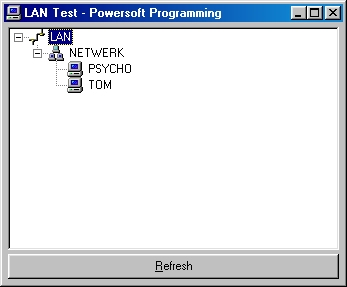



## Show all Domains and Computers in LAN

### Description

After searching for this without results for about a year, I put all little bits of code I have found together and created these two Class Modules. One Class Module handles the enumeration of the Domains / Workgroups in your LAN, the other handles the enumeration of the Computers available in a specific domain. Included is a small demonstration program (as shown in the screenshot). Because of the Class Modules, you can easily add this functionality to any other program. This has only been tested on Win98 SE (so it does work on Win98, not like most other examples I have found, they only worked on WinNT). If anyone has problems with the enumeration on certain systems, please let me know so I can work it out. As usual, please leave comments, and vote if you like.
 
### More Info
 

             |
---                |---
**Submitted On**   |2001-02-10 13:26:46
**By**             |[Mark van Renswoude](https://github.com/Planet-Source-Code/PSCIndex/blob/master/ByAuthor/mark-van-renswoude.md)
**Level**          |Intermediate
**User Rating**    |4.8 (81 globes from 17 users)
**Compatibility**  |VB 5\.0, VB 6\.0
**Category**       |[Miscellaneous](https://github.com/Planet-Source-Code/PSCIndex/blob/master/ByCategory/miscellaneous__1-1.md)
**World**          |[Visual Basic](https://github.com/Planet-Source-Code/PSCIndex/blob/master/ByWorld/visual-basic.md)
**Archive File**   |[CODE\_UPLOAD147612102001\.zip](https://github.com/Planet-Source-Code/mark-van-renswoude-show-all-domains-and-computers-in-lan__1-15174/archive/master.zip)

### API Declarations

All in the class modules.

